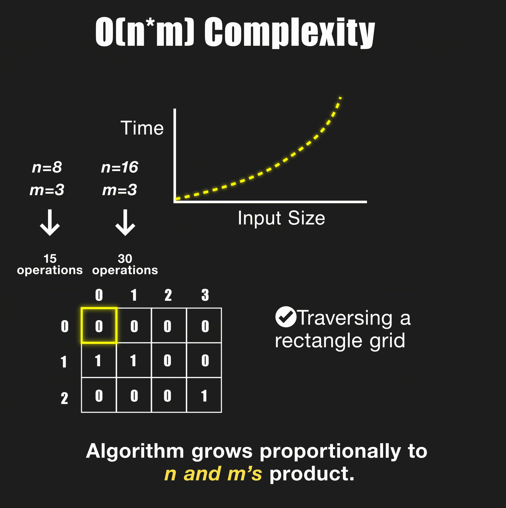
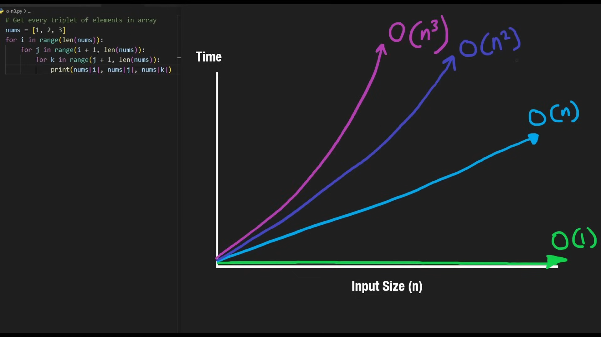
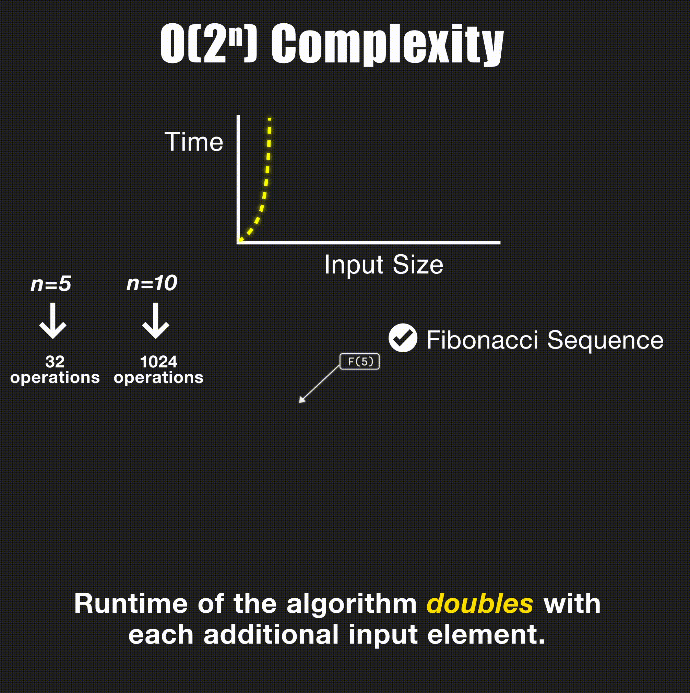

# [Big-O Notation - For Coding Interviews](https://youtu.be/BgLTDT03QtU?si=VlSZZWZFTC1M7LIT) - [NeetCode](https://www.youtube.com/@NeetCode)

## What is Big-O
- Way of analyzing the amount of time for our algorithm to execute as the input size (n) grows.
- It obviously going to grow as the input size grows, like in linear algebra `y = x`, represented as O(n).
<!--  -->


- Different from algebra, O(n/2), O(n + 5) are not considered as differenct from O(n). Only the variables are considered, not the constant value differences. This is same for all Big-O runtimes.
- It is important to note that Big O notation is a worst-case scenario.

## O(1)
- 1 is a special constant, that must be considered.
<!--  -->


<!--  -->


- Examples:
    ```python
    # Array
    nums = [1, 2, 3]
    nums.append(4)    # push to end
    nums.pop()        # pop from end
    nums[0]           # lookup
    nums[1]
    nums[2]


    # HashMap / Set
    hashMap = {}
    hashMap["key"] = 10     # insert
    print("key" in hashMap) # lookup
    print(hashMap["key"])   # lookup
    hashMap.pop("key")      # remove
    ```

## O(n)
- Linear Growth Scenario
- Worst-Case scenario is considered in assumptions
<!--  -->


<!--  -->


- Examples:
    ```python
    nums = [1, 2, 3]
    sum(nums)           # sum of array
    for n in nums:      # looping
        print(n)

    nums.insert(1, 100) # insert middle
    nums.remove(100)    # remove middle
    print(100 in nums)  # search

    import heapq
    heapq.heapify(nums) # build heap

    # sometimes even nested loops can be O(n)
    # (e.g. monotonic stack or sliding window)
    ```

## O(n^2)
- Quadratic time complexity.
<!--  -->


<!--  -->


- Examples
    ```python
    # Traverse a square grid
    nums = [[1, 2, 3], [4, 5, 6], [7, 8, 9]]
    for i in range(len(nums)):
        for j in range(len(nums[i])): 
            print(nums[i][j])


    # Get every pair of elements in array
    nums = [1, 2, 3]
    for i in range(len(nums)):
        for j in range(i + 1, len(nums)):
            print(nums[i], nums[j])

    # Insertion sort (insert in middle n times -> n^2)
    nums.insert(1, 100) # insert middle - 0(n)
    ```

## O(n*m)
- For nested loops with m iterations in the inner loop & n iterations in the outer loop.
<!--  -->


<!--  -->


- Examples:
    ```python
    # Get every pair of elements from two arrays
    nums1, nums2 = [1, 2, 3], [4, 5]
    for i in range(len(nums1)):
        for j in range(len(nums2)):
            print(nums1[i], nums2[j])

    # Traverse rectangle grid
    nums = [[1, 2, 3], [4, 5, 6]]
    for i in range(len(nums)):
        for j in range(len(nums[i])):
            print(nums[i][j])
    ```

## O(n^3)
- Cubic time complexity
<!--  -->


- Examples:
    ```python
    # Get every triplet of elements in array
    nums = [1, 2, 3]
    for i in range(len(nums)):
        for j in range(i + 1, len(nums)):
            for k in range(j + 1, len(nums)):
                print(nums[i], nums[j], nums[k])
    ```

## O(logn)
- Logarithmic time complexity
- the number of times you can divide a number, n, by 2 until you get to 1 is logn.
  - Inversly, the number of times 1 must be multiplied by 2 to get n.
  - so, `1 . 2^x = n`  
  - `log 2^x = log n`
  - `x = log n of base 2` 
- For very large input sizes, O(logn) is practically a flat line closer to O(1).
  - Ex. Log base 2 of 4 billion is 4.52
<!--  -->


<!--  -->


- Examples:
    ```python
    # Binary search
    nums = [1, 2, 3, 4, 5]
    target = 6
    l, r = 0, len(nums) - 1
    while l <= r:
        m = (l + r) // 2
        if target < nums[m]:
            r = m - 1
        elif target > nums[m]:
            l = m + 1
        else:
            print(m)
            break

    # Binary Search on BST (Balanced)
    def search(root, target):
        if not root:
            return False
        if target < root.val:
            return search(root.left, target)
        elif target > root.val:
            return search(root.right, target)
        else: 
            return True

    # Heap Push and Pop
    import heapq
    minHeap = []
    heapq.heappush(minHeap, 5)
    heapq.heappop(minHeap)
    ```

## O(nlogn)
- combination of n multiplied by logn
- The runtime of the algorithm grows linearly with the input size and the logarithm of the input size
- marginally less efficient than O(n), but lot better than O(n^2)
- Most common algorithms with this runtime are sorting
<!--  -->


<!--  -->


- Examples:
    ```python
    # HeapSort
    import heapq
    nums = [1, 2, 3, 4, 5]
    heapq.heapify(nums)     # O(n)
    while nums: # O(n)
        heapq.heappop(nums) # O(logn)
    # actual runtime is n + nlogn
    # But in Big-O, only the larger term is considered.
    # In case of m + nlogn, it is different

    # MergeSort (and most built-in sorting functions)
    ```

## O(2^n)
- Exponential time complexity
- Non-Polynomial runtimes
- O(2^n) is a reflection of O(logn)
- Most common in recursion, computing the Fibonacci series recursively
<!--  -->


<!--  -->


- Examples:
    ```python
    # Recursion, tree height n, two branches
    def recursion(i, nums):
        if i == len(nums):
            return 0
        branch1 = recursion(i + 1, nums)
        branch2 = recursion(i + 2, nums)
    ```

- O (c^n)
<!--  -->


- Examples:
    ```python
    # c branches, where c is sometimes n.
    def recursion(i, nums, c):
        if i == len(nums):
            return 0
        
        for j in range(i, i + c):
            branch = recursion(j + 1, nums)
    ```

## O(sqrt(n))
- Square root time complexity
- Ex. finding all factors of a number
<!--  -->


<!--  -->


- Examples:
    ```python
    # Get all factors of n
    import math
    n = 12
    factors = set()
    for i in range(1, int(math.sqrt(n)) + 1):
        if n % i == 0:
            factors.add(i)
            factors.add(n // i)
    ```

## O(n!)
- Factorial Time Complexity
- Most commonly comes up in Permutations & Graph Problems like Travelling Salesman.
<!--  -->


<!--  -->


- Examples:
    ```python
    # Permutations
    def permute(nums):
        def backtrack(path, nums):
            if not nums:
                res.append(path)
                return
            for i in range(len(nums)):
                backtrack(path + [nums[i]], nums[:i] + nums[i + 1:])
        res = []
        backtrack([], nums)
        return res
    ```